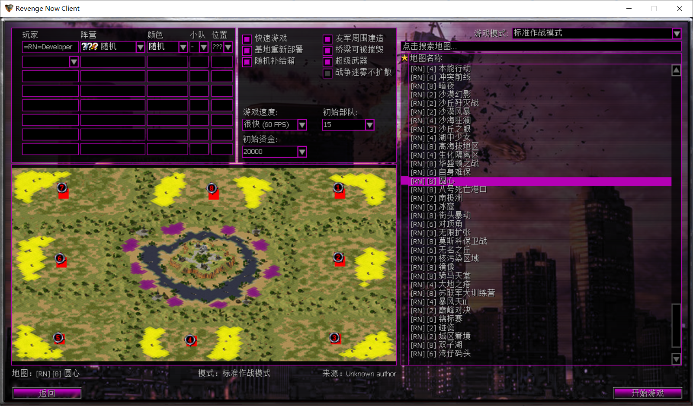
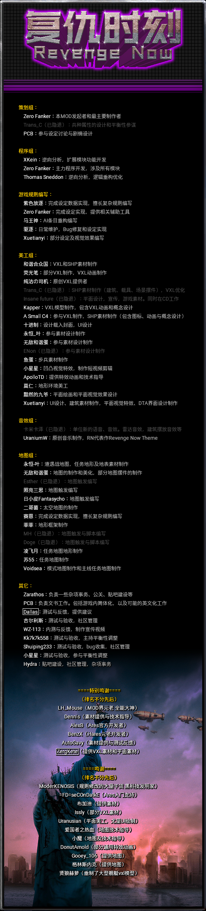

# 复仇时刻 0.99.G1208 公测版发布

## 宣传视频

## 序言

2019，又是跳票的一年，这一次我们终于在年末前放出了新的版本。不过，复仇时刻制作者并不是休了个长假，相反这一年当中我们以饱满的热情披荆斩棘，克服重重障碍，为复仇时刻带来更丰富的游戏体验！
——By Zero Fanker

## 招募广告

******************************前排广告！！！！***************************

本MOD诚招美工师， 素材师，无论你擅长3ds max，maya ，photoshop 还是Voxel Editor ，或者你擅长使用FA2制作地图（地形或触发），擅长编写程序（无论C/C++、JAVA、C#），请第一时间与制作组联系！联系方式在本文档最底端！

******************************= 广告完毕 =***************************

## 免责声明

由于此MOD是公测免费版，内部所使用的一切素材归原作者所有，使用时请注意版权。由于此次公测文件采取一定的加密方式，使用传统的XCC一类工具无法打开，制作组不鼓励并不为以任何方式对游戏文件进行破解导致可能出现的数据损毁情况负责。即使你有破解的能力，你的本地化修改不会受到限制，但是未经原作者同意不得将其内容发布于网络或用于商业性质。
你可以无限次复制和发布此文件的副本，但是未经作者同意，不得发布此扩展文件的任何修改版，也不得将其内容用作商业用途。
另外，此MOD为更新升级包，此安装包必须在旧版复仇时刻0.98.728版本以上。安装完成后方可通过启动器启动，详细见第三部分。

## 游戏运行及常见问题解答

1. ====安装说明====  
该版本为独立安装的完整包，不得覆盖安装任何同类MOD或原版游戏，也不可用于覆盖旧版复仇时刻。另外请不要将其它的扩展包混入，地图包仅支持不带额外规则修改的竞技类地图，支持绝大部分基于原版的自编地图。
本MOD使用Ares 0.A加强版，使用了自主研发的扩展模块和独立的启动器，请勿尝试窃取制作组的劳动成果！
特别注意：运行游戏请使用Launcher.exe，不要自作主张采用其它方法，如果无法正常启动，请将Revenge.ext、RunRN.exe、YURI.exe、RA2MD.exe、GameRN.exe、GameMD.exe加入杀毒软件白名单。（不知道如何操作的请自行百度）
如果在安装后出现游戏不能玩的问题，请检查您的计算机是否已正确安装相关的驱动程序，游戏路径不包含中文和特殊字符，以及尝试运行游戏文件夹内的SetupReg.exe。常见问题指南见：
<https://github.com/Zero-Fanker/Revenge-Now/wiki/%E5%B8%B8%E8%A7%81%E9%97%AE%E9%A2%98%E6%8C%87%E5%8D%97>
2. ====联机说明====  
    1. 经过我们制作组反复的测试和实践，复仇时刻现在已经可以在各大对战平台上正常联机游戏，推荐使用游侠或浩方平台，游侠平台选择RA2MD.exe启动，浩方选择YURI.exe。其他对战平台暂待测试，欢迎尝试和反馈。
    2. 窗口化运行，Win7及以下系统现在不必手动将桌面设置为16色，在启动器勾选窗口化，或联机时用命令行参数“ -WIN”即可。（注意空格）；
Win8和Win10系统的玩家需要检查GameRN.exe和GameMD.exe是否设置了使用简化的颜色（65536色），并使用命令行参数“ -WIN”。
    3. 鉴于反复测试，该游戏引擎在分辨率过大时将产生极大的效能负担，故为了游戏流畅度对联机时最大分辨率做了一定的限制。如果你在全屏游戏时出现了黑边，请参阅以下链接解决黑边问题：
jingyan.baidu.com/article/49711c61478e7bfa441b7cc0.html
    4. ====FE（崩溃反馈）及建议和意见====  
由于此扩展文件仍在制作中，在游戏过程中难免遇到BUG和错误或者平衡性等问题，欢迎向制作组积极反馈。
如果遇到错误提示框，请描述错误发生时你所做的或者电脑所做的操作，例如：“某某任务中，我摧毁了心灵信标之后报错了。”、 “我在使用侦察机的时候，鼠标一点黑雾处，就报错了。”一些随机性偶然错误，请尽量反复验证后再反馈。
另外，建议在游戏运行时保留-LOG命令或是在启动器勾选“记录日志”，在遇到游戏崩溃信息时，如有确定/取消页面，点击确定，并将游戏文件夹下debug文件夹中立即生成的dump文件夹反馈给制作组，正常情况下该文件夹将包含3个文件：except.txt，debug.log（如果运行时保留了-LOG），*.dmp文件，其中*.dmp文件体积较大，请将文件夹压缩后再反馈至邮箱。
如果你对游戏扩展的内容有任何意见或建议，欢迎在Github、帖吧、QQ群等社区进行反馈和讨论，联系方式详见本文档最底部。如果复仇时刻的扩展内容侵犯到了你的合理权益，请联系制作组协商解决。
此外，Bug反馈页面已经迁移到Github，原先的Bitbucket不再使用，详见：<https://github.com/Zero-Fanker/RN_All_Issues/issues>  ，任何疑问或者Bug反馈都可以在这个页面提交内容，提交时可选择已有模板，请注意格式要求。Github社区的帐户是免费的，可以放心注册。

## 【重要变更】

A. 》》游戏性改动《《
    全局：
    1. 优化了新的AI条目，现在AI会视情况更加灵活地使用超时空传送仪和铁幕装置。
    2. 中立方钻矿设备默认设置为可被占领。

    盟军：
    1. 新增法国防御建筑气象塔建筑（屏蔽粉碎大炮）。
    2. 韩国黑鹰战机武器机制调整，主武带有范围三格的燃烧弹头，对建筑的杀伤大幅提升，经过火焰的海陆单位将会受到持续灼烧。
    3. 英国狙击手增加部署攻击模式，部署后攻击显形，对射速增快但命中率略低；对步兵伤害与非部署形态持平，重甲和建筑较弱，轻甲较大，观察员依然提供    三倍加成。
    
    苏联：
    1. 新增苏俄天降红潮技能：三架次飞机空降部署，单位包含动员兵、防空步兵、磁暴步兵、防空履带车、恐怖机器人。
    2. 古巴单位恐怖分子改为伪装渗透单位，新增单位荣耀战士。

B. 》》设定/数据调整《《
    全局：
    1. 在盟军阵营新任务第三关中，平定装置的建造机制完善，同时增加了实际的平定装置功能，范围25格的敌军单位将无法开火。
    2. 照明灯赋予了少量视野，但仅能显示探照灯本身。
    3. 调整了重制版主线任务盟军2、3关的AI.
    4. 对苏军第一关任务的AI小队进行了调整。

    盟军：
    1. 光棱坦克反甲能力下调至原来的一半（恢复到原版YR数值），移动攻击能力得到保留。
    2. 引入了圣骑士与苏系T4运输车在带盾情况下免疫心控的设定。现在英国圣骑士战甲存在护盾时免疫心控盾消失时可被心灵控制。
    3. 盟军捕食者引入缓慢加速机制，减慢转身速度。
    
    
    苏联：
    1. 苏军磁暴水母分裂弹头减少至1，直接命中和分裂弹伤害均减少30%，单位移速减少1。越南的毒蝎坦克取代犀牛坦克的位置，下调生命值至275，下调了攻击    力，微调了攻击效果，价格下调为900。
    2. 苏军米格战机对装甲单位的伤害进行了下调，大幅削弱对基地车载具的影响，对矿车进行了削减。
    3. 下调赤炎坦克分裂弹数量至两个，削弱减速效果由原来的减半变成60%。
    4. 烈焰核心加强，速度改为4，生命值改为1400，自毁状态免疫心控。
    
    尤里：
    1. 尤里x不再允许进入钻地突击车作为乘客。

C. 》》机制变更《《

    1. 启动器支持显示版本号。
    2. 启动器现在能够自动更新游戏版本并更新自身了。

## 【一般性变动】

A. 游戏体验
    1. 增加地图开发者功能，命令行参数加上-checkoverlap可在读取地图时校验建筑重叠情况，若发现则中止加载并提示重叠坐标（坐标提示与FA2的X,Y值相    反）。
    2. 更改了浮岛要塞地图音波栅栏的寻路规则，现在运作中的音波栅栏将被视作实体障碍物。
    3. 更新了菜单界面的制作人员名单。
    4. 引入新判定机制，允许仅将小队的第一个载具单位视为运输器，以解决存在多个可作为运输器的载具混编时的问题。
    5. 重构了RE(reconnection error)收集机制的文件写入，恢复了旧版方式的内容写入。
    6. 启动器将会尝试自动给Win7 及以上用户的 RA2MD.EXE YURI.EXE RunRN.EXE GameRN.EXE GameMD.EXE获取管理员权限，并为GameRN.EXE GameMD.EXE设    置16色运行。
    7. 针对AI工程师小队进行微调，增加了AI消除冗余工程师单位的措施。

B. 图像、音频等
    盟军：
    1. 调整了盟军攻城机甲的空降投放机制。
    2. 韩国黑鹰战机燃烧弹头更换新的动画素材（By 小星星）。
    3. 英国狙击手部署武器弹头动画替换。
    4. 新增暴风摩托数据和音效。

    苏联：
    1. 更换了苏军的游戏内UI（侧边栏、按钮等）。
    2. 磁暴水母将使用独立的开火和移动音效。
    
    尤里：
    1. 新增尤里T4兽人三兄弟狂暴分子的不同图像。
    2. 更换了尤里的游戏内UI（侧边栏、按钮等）。

C. 地图
    1. 主线任务放出了盟军第三关。
    2. 新城市地表（UrbanNew）引入斜坡河堤元素，适用浮岛地图。
    3. 新城市地表（UrbanNew）地形引入新增的柏油路相关地块。
    4. 月球地形新增水泥悬崖套装。
    5. 优化了浮岛要塞地图的布局。

D. Bug修复

    * 修正了读取存档后AI有多个建造厂时可以同时制造建筑的问题。
    * 攻城机甲的可以通过走A击自己脚下并对自己造成伤害，这将不再被允许； 
    * 生化起源第一关通关后点击结算的继续按钮后游戏会崩溃，现在改为直接进入制作人员名单； 
    * 德国极光支援车无法攻击防空无人机的无人机，现已修复。 
    * 粉碎大炮和战术核炮可在玩家控制或自动攻击时可能对空中单位造成伤害。 
    * 米格轰炸队的炸弹将不再会对己方机群造成影响。
    * 修复了移动厕所被摧毁的特效动画色盘错误。 
    * 尤里方渗透了敌方战车工厂之后，重力塔攻击时弹道会显示老兵标志，这将不再发生。
    * 修正了对苏俄磁能要塞使用基因突变会导致要塞被摧毁的问题。 
    * 磁暴步兵给ACS运载车充电会导致运载车护盾消失，这将不再发生。
    * 修正了存档再读取后，使用超时空武器的单位被摧毁会导致程序崩溃的问题（感谢群友za-zen 1938611698 的crashdump反馈）。
    * 修正了读取存档后，使用磁暴武器可能导致程序崩溃的问题。
    * 修正了开发者乐园地图审判之日克里姆林宫附近建筑被摧毁会导致崩溃的问题，一并修正了盟1、盟3建筑重叠可能导致崩溃的问题。
    * 紧急修正了无畏级战舰被击毁导致程序崩溃的问题。
    * 修正了苏军空域卫士被击毁时可能导致程序崩溃的问题。
    * 修复韩国光明星自行火炮和忠武级战舰在使用集火炮击技能时炮管不能正确上扬的问题。
    * 不同版本号的RN可能可以互通联机导致RE，从该版起将不再允许，严格校验版本号。
    * 修正了玩家建造厂所属被更改时，存在就绪的建筑，再次获得建造厂后按热键Q会导致崩溃的问题。
    * 紧急修复了单位遭受EMP效果时会导致程序崩溃的问题。
    * 修复了主线盟3任务平定装置，建造动画播放两次的问题。
    * 修复了AI尤里钻地车无法正确寻路的问题。 
    * 修正了磁能坦克和磁暴步兵会主动给磁暴线圈充能无法正常攻击的问题。 
    * AI在全体冲锋状态时，归属该AI的条顿坦克残骸会响应指令，这将不再发生。
    * 修正苏军AI武直部署状态不正常的问题。 
    * AI派遣步兵进入敌方战斗碉堡后，碉堡可能因为AI战败而强制变卖。现在碉堡将不再能被非法变卖。
    * 修复了窗口化游戏时，滑条控件漂移的问题。
    * 修正了光棱镜分队进入圣骑士机甲会导致崩溃的问题
    * 修正了更换后的法国气象塔雪地闲置动画影子的问题。
    * 减少了AI载具携带工程师的数量
    * 修正了读取存档后会导致被禁止的AI建筑和飞行器克隆又被开启的问题。
    * 修正了德国灰熊uc对防御类建筑伤害异常的问题。
    * 修正了新苏联第一关任务中紫色所属方会生产毒蝎坦克与赤炎坦克的问题。
    * 在重工生产了攻城机甲后，会导致集结点地块不允许建造并且通过，这将不再发生。
    * 新苏联任务第一关中，有一处悬崖会导致单位遁地，这将不再发生。
    * 圣骑士机甲在有护盾时将不再能被恐怖机器人寄生攻击，但无盾时可被攻击
    * 利刃召唤的机械单位可被警犬攻击并消灭，这将不再发生。
    * 在之前的版本中，一些建造速度较慢的建筑，在保存再读取存档之后，速度会变得异常快，现在这个问题不再会发生。
    * 英国观察员召唤的智能炸弹可以被铁幕和立场护盾影响，这将不再被允许。
    * 尤里空投炸弹之前可以被神经突击毒气影响，现在不会再受到影响。
    * 古巴自爆飞机出厂时会出现在盟军的停机平台上，而不受停机平台机位控制，现在盟军停机平台不再允许生产出自爆飞机。
    * 修正了内测盟军第三关任务目标一完成后，援军中的圣骑士战甲无法正确登场的问题。
    * 修正了有时AI的特殊小队会导致游戏崩溃的问题（建筑目标编写错误）。
    * 修正了RE(reconnection error)收集机制的文件写入错误。
    * 修正了联机时古巴的自爆飞机被击落会造成崩溃和断线的问题。
    * 修正了苏系阵营的国家存在核能反应堆时，被摧毁无法判定该所属方失败的问题。
    * 修复若干F1028版本的任务无法通关的问题。
    * 修正了苏联阵营新任务第一关-红色沙文中，逮捕将军后无法通关的问题。
    * 修正了TR旧任务尤里第一关，心灵信标部署无效果，任务四无法完成造成卡关的问题。
    * 修正了TR旧任务-盟军黑森林开局核弹爆炸时导致游戏崩溃的问题。
    * 修正了敌友关系发生改变时可能导致敌方隐形单位直接可见的问题。
    * 修正了12.31反馈的crashdump，与部分武器伤害判定有关联的问题。
    * 修正了满血的建筑可能会残留维修扳手状态的问题。
    * 苏联阵营新任务第一关调整，友军颜色改为深红，伊文重合修正，部分布局调整。
    * 修正了地图-骑马天堂修正地形错误和科技建筑摆放错误的问题。
    * 修正了尤里钻地突击车平地运动和钻地运动模式选择不明确的问题。
    * 修正了石油大亨模式中古巴/法国无法顺利延伸科技树的问题。
    * 修正了盟军掷弹兵攻击时可能导致游戏崩溃的问题。

## 》》内容预告《《

包含更多功能的DTA启动器正在开发中，敬请期待更精彩的游戏体验……

## 下载地址

* 度盘：  
    -【独立安装包，不可用于YR，不可覆盖安装旧版】  <回撤修正> 提取码：  
    -【更新程序，需要0.98.728及以上版本】  <https://pan.baidu.com/s/12REWdUxwiMPhFMf5A4LrEQ>
提取码:8y0p  
* 腾讯云：（上传中）

## 制作人员信息及鸣谢

