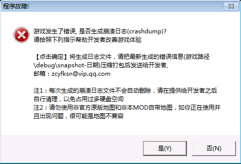

[返回首页](./Home)

***

## FE和RE

在知道打包debug文件之前，你要先了解什么是**崩溃**

这里是指**游戏发生重大错误**，被迫**终止游戏**的行为。

在复仇时刻里，崩溃分两种：

一种是**FE**

一种是**RE**

FE是指游戏**发生未知的错误**，RE是指**游戏同步连接错误**（联机才有的情况）

FE会生成1份东西

包括：**debug.log**和**一份标注在日期的文件夹**
（debug.log是打开游戏的时候就已经存在的）

RE会生成两份东西和一个文件夹

包括：**debug.log**、**一份标注在日期的文件夹**和**sync文件**

****注意****：FE在**单机、联机**均可能发生，而RE只能是在**联机**时发生，并且RE的debug文件需要**多个人一起提供**才能完整。

****注意****：debug文件的生成时间要对应游戏崩溃的时间

## 如何处理debug文件

玩家需要根据弹窗的描述来判断是哪种崩溃，并提供打包好的的debug文件给管理员或者制作人员

注意：debug文件需要**打包**，打包是指**把debug文件压缩成压缩包**的操作。

玩家需要提供：**复仇时刻版本号、游玩的地图、使用的模式、属于什么类型的崩溃和崩溃前你在游戏里做了什么**，这些信息。

发送完毕之后，玩家即可删除在本地的debug文件，以节省硬盘空间。

***

[返回目录](./常见问题指南)

