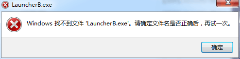

 - 发生以上情况你，你需要
    
    - 确认你的独立安装包**版本号为G1208**，并且确保**安装包没有损坏**。

    - 尝试打开launcher启动器，**无视弹窗**，检查启动器进程是否启动，并且使用启动器进行自动更新到G1208B版本。

 - 注意：现**G1208的自动更新已经失效**，G1208启动器需要安装自动更新补丁进行更新来解决这个问题，自动更新补丁在复仇时刻交流服务群里

 - 群测更新包获取方法：[最新版本下载](./最新版本下载)

  - 如果问题还未解决，请在复仇时刻公测群联系客服或者管理员