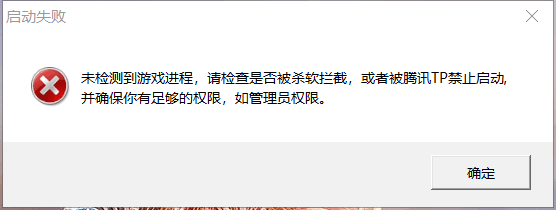

[返回首页](./Home)

这种弹窗，主要是杀软的拦截，要么卸载杀软要么加入白名单，各个杀软白名单方式不同，请在自行百度

还有就是管理员权限，请将Revenge.ext、RunRN.exe、YURI.exe、RA2MD.exe、GameRN.exe、GameMD.exe加入杀毒软件白名单。（不知道如何操作的请自行百度）

把6个exe都增加管理员权限，再吧杀软调教好，那就不会再出现这个问题了

[返回目录](./常见问题指南)

