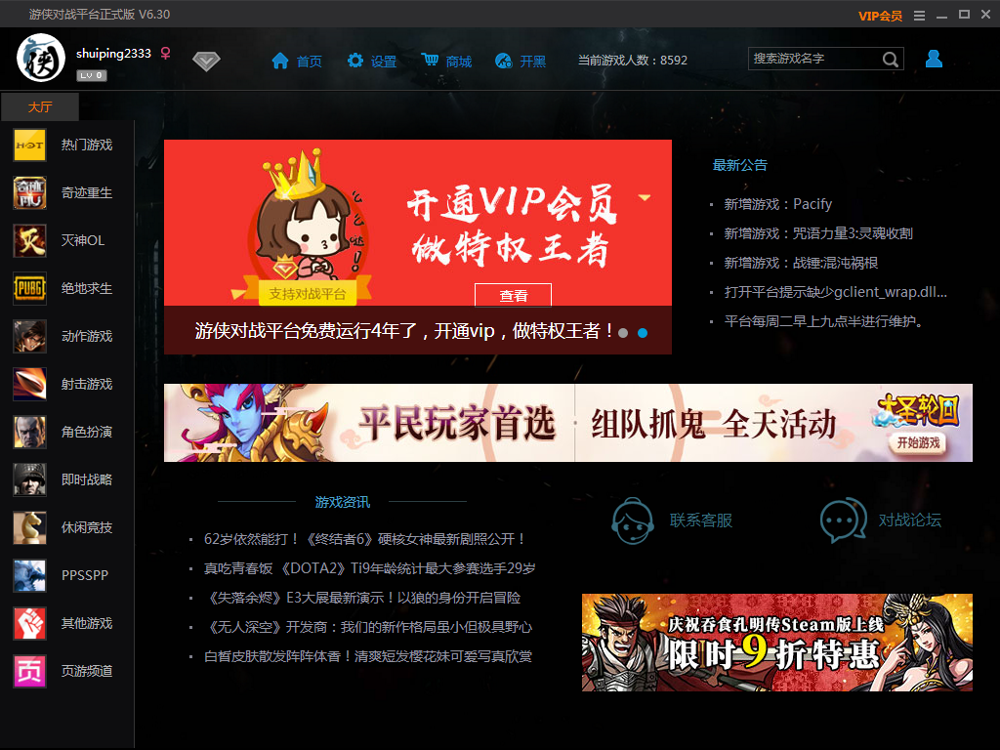
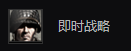
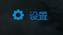
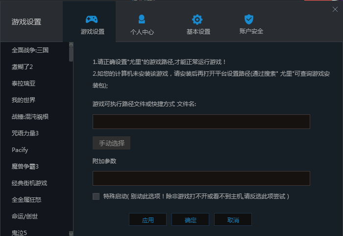
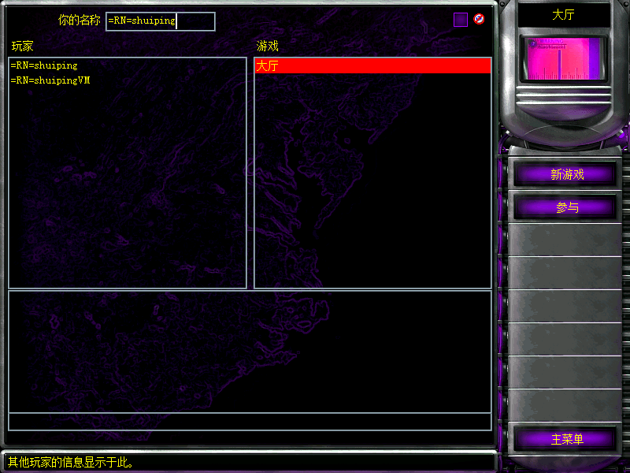

[返回首页](./Home)

***

1、打开以下网址：
立即下载：http://soft.ali213.net/pk/ali213pk_kh6.30.rar

百度云下载：https://pan.baidu.com/s/1KNRKH1TeeiBix6N8bIX3aw#list/path=%2F%5B2019-07-09%5Dali213pk_kh6.30

不会用百度云请使用立即下载网站。谢谢

2   下载好游侠安装包，进行安装，这一步不会请 百度！

3   打开游侠对战平台，输入账号和密码，登录（可以使用QQ登录）

**没有账号请注册**

4  登录成功后，会显示游侠对战平台的主页面

 

左边列表里，选择**即时战略**

然后，隔壁会多出一个列表，选择**尤里**

然后就会看见页面显示尤里复仇的三个大区

**日牛联机一般是双线1.001**

（可以根据联机电脑网络的运营商来决定选什么区）

进入专房后，你要先**设置**好复仇时刻的路径才能读取到复仇时刻

所以，点选上方的 **设置**   ，

显示这个界面

然后，点击 **手动选择**，寻找到你**复仇时刻的安装目录**，

并且找到复仇时刻的  **RA2MD.exe**  这个程序

然后，点击**确定**

接着，设置页面就会关闭，然后就可以点击 **开始游戏** 了

- 注意：因为该游戏引擎在**分辨率过大**时将**产生极大的效能负担**（体现为游戏帧数很低），故为了游戏流畅度对联机时最大分辨率做了一定的限制。

所以，一定要记得先进入选项进行 **选项** 来调节 **分辨率** 。

如果你在全屏游戏时出现了黑边，请参阅这里解决黑边问题：

http://jingyan.baidu.com/article/49711c61478e7bfa441b7cc0.html

可以进入大厅，并能看见对方的名字，即可

 
## 你们都没办法看见对方，怎么办？
 
- 在游戏对战平台的设置中，把
特殊启动 勾选上

- 检查你的网络，是不是网络问题

- 检查你的杀软，或许是杀软拦截了游侠

- 退出游侠，并且重新打开游侠，再试一次

-------------------------------------------------------------------------------------------------------------------------------

## 窗口化

Win8 或者win10玩家如果想联机游戏窗口化，那么请在复仇时刻根目录找到**GameRN.EXE GameMD.EXE**并给这两个exe设置16位色。

并且在游侠设置中的**附加参数**输入 -WIN，注意前面空一个空格，**注意大写。**

**在此不建议win7用户窗口化**

## 联机序列号问题

在进入房间时，如果弹出  序列号相同  ，那么就请打开复仇时刻根目录，用搜索功能打上 **序列号** 三个字，就会找到 **序列号更改工具**

双击打开它，，然后点击 Generate 然后就可以了

然后关闭序列号工具，再重新启动游戏  ，就不会显示序列号相同了。

***
[返回上一级](./使用第三方对战平台)
--------------------------------------------------------------------------------------------------------------------------
[返回目录](./常见问题指南)

