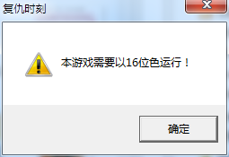

[返回首页](./Home)

***

- 新版复仇时刻(0.99.901版本及其更新版本)已经自带cncddraw渲染补丁，可以通过**alt+enter**（回车）在游戏内切换全屏或者窗口化模式

- 如果无法切换窗口化模式或者快捷键失效，请参见：[补丁失效解决方案](https://github.com/Zero-Fanker/Revenge-Now/wiki/%E8%BF%90%E8%A1%8C%E5%90%8E%E8%8F%9C%E5%8D%95%E4%B8%8D%E6%98%BE%E7%A4%BA%E9%97%AE%E9%A2%98#%E5%85%A8%E9%83%A8%E8%A1%A5%E4%B8%81%E6%89%93%E8%BF%87%E4%BA%86%E9%83%BD%E6%B2%A1%E6%9C%89%E6%95%88%E6%9E%9C%E6%80%8E%E4%B9%88%E5%8A%9E)

- 适用于win7/win10用户的教程：https://jingyan.baidu.com/article/ff42efa9cda0ecc19e220297.html

- 调成16位色显示模式之后桌面会很难看，无法忍受的话请不要调16位色显示模式

***
[返回目录](./常见问题指南)