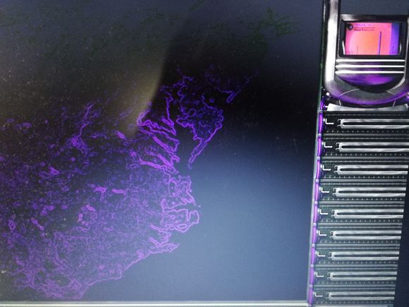
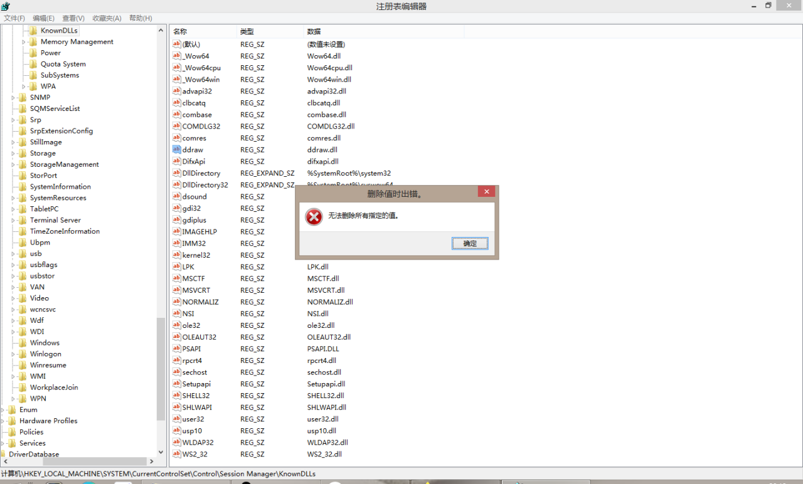
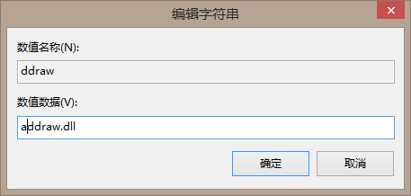
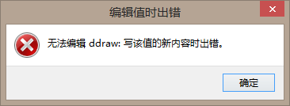

[返回首页](./Home)

***
 

## 新方法（G1208版本以上使用） 
- 【使用方法】
打开游戏根目录，找到**一键切换WIN10兼容补丁.bat**，双击打开，即补丁安装完毕。
- 【注意事项】
**如需切换补丁，再一次打开bat即可**，补丁编号对应补丁文件夹里补丁从上往下的排列顺序（仅文件名升序排列）

- 切记，新方法和老方法**不得混用**！！！

## 老方法（F1028版本以下使用）
- 请在群文件**下载补丁**，并**安装至复仇时刻根目录**。每个补丁逐个尝试，安装最适合的补丁即可。

- F1028版本的独立安装包安装后自带补丁
（E907版本独立安装包则没有）

- 【使用方法】
选择其中一个压缩包，文件解压缩，复制到上一级文件路径（默认为YR-RN，或者你自己命名的游戏根路径，能找到GameRN.exe的文件夹）文件夹内；如果没有效果，【删除补丁文件后】尝试另一个。

- 【其它建议】
如果本压缩包内的补丁无效，可按如下提示自行尝试；

 1，未打补丁的情况下，在启动器勾选窗口化。注意此种办法可能导致游戏效能严重下降；

 2，安装虚拟机。百度搜索virtual box玩红警2 ；

 3，装低版本系统，例如WIN XP（不推荐） ,WIN 7。

 4，**控制分辨率**，补丁效果不好极有可能是分辨率过大导致的（大部分闪退问题是补丁和不合适分辨率造成的）

## 全部补丁打过了都没有效果，怎么办？

- 注意：请**确保使用过所有补丁都不生效**再使用此方法，该方法适用于win8以及win10用户（win7用户不需要使用补丁也不需要看）

首先，使用**win（菜单键）+r**快捷键，呼出“运行”窗口，在输入框内输入regedit，回车（确定）。或者在C盘找到window文件夹、regedit.exe，即可启动注册表编辑器

接着，弹出注册表编辑器，根据以下目录
**HKEY_LOCAL_MACHINE\SYSTEM\CurrentControlSet
\Control\Session Manager\KnownDLLs**
找到**ddraw**的那一条，

双击打开，于“数值数据”输入框内添加任意内容（例如在**前面加一个a**） 
找到**ddraw**的那一条，双击打开，于“数值数据”输入框内添加内容（例如在**前面加一个a**） 

改完后，关闭注册表编辑器，**重启电脑**，然后再回到根目录，再**重新尝试安装合适的补丁**，直到合适为止。

若出现“编辑值时出错” 
，不能编辑的情况下，在C盘找到window文件夹、regedit.exe，鼠标右键“**用管理员身份运行**”，若仍然不允许编辑，那么参见这个教程：[教程链接](https://baijiahao.baidu.com/s?id=1604347607947449668&wfr=spider&for=pc&isFailFlag=1)

***
[返回目录](./常见问题指南)